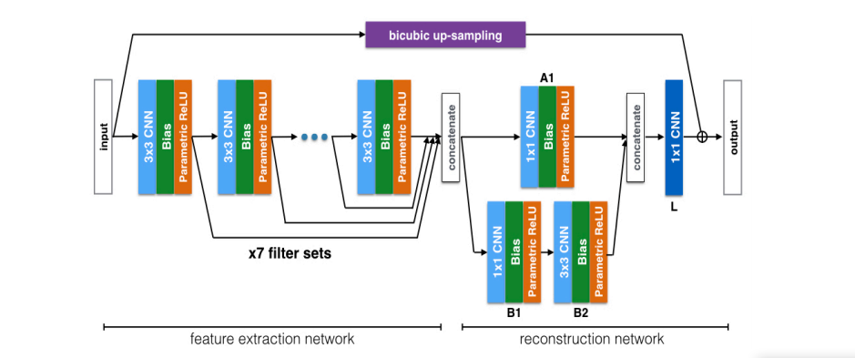

# DCSCN: Image Super Resolution by Deep CNN

## Introduction
The algorithm is built based on the [paper](https://arxiv.org/ftp/arxiv/papers/1707/1707.05425.pdf).

Input dataset is taken from [data vision](https://data.vision.ee.ethz.ch/cvl/DIV2K/).

